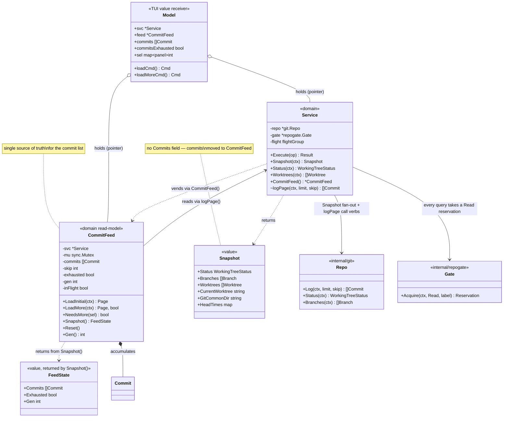
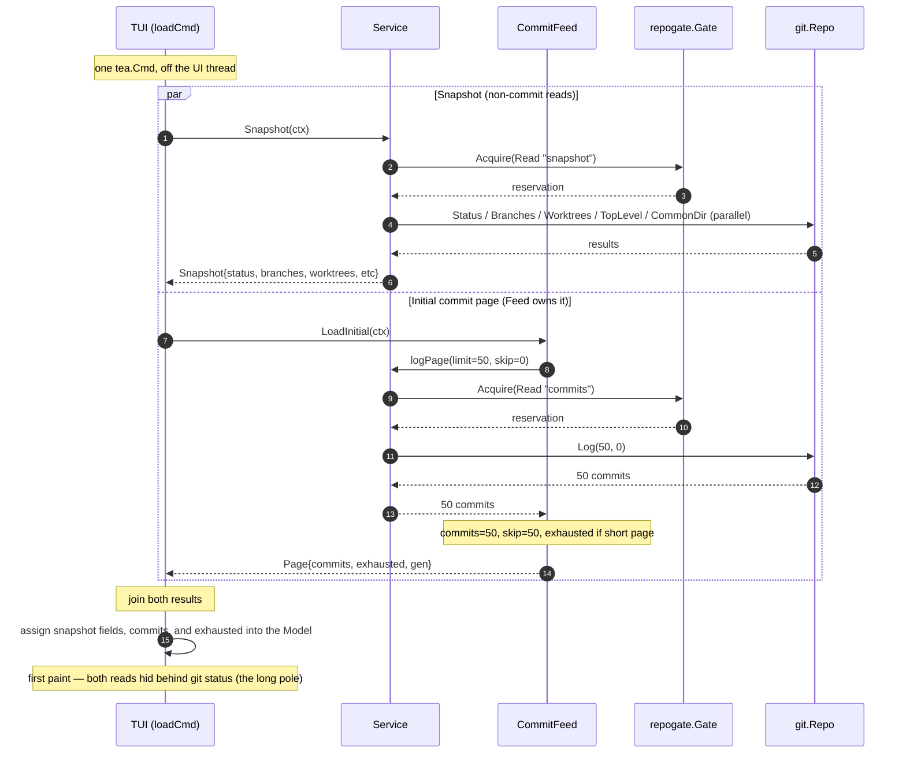
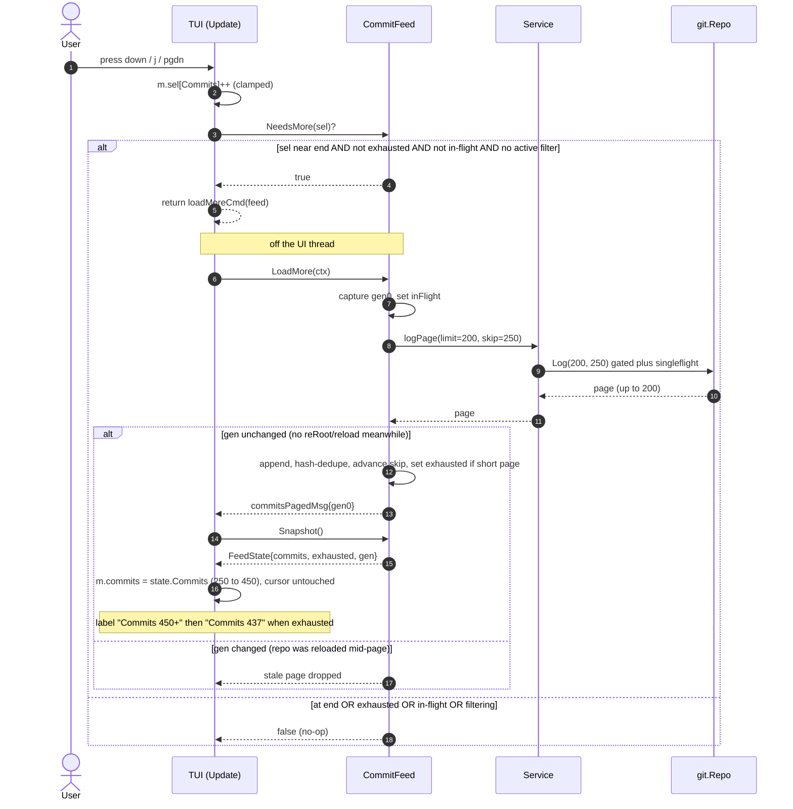
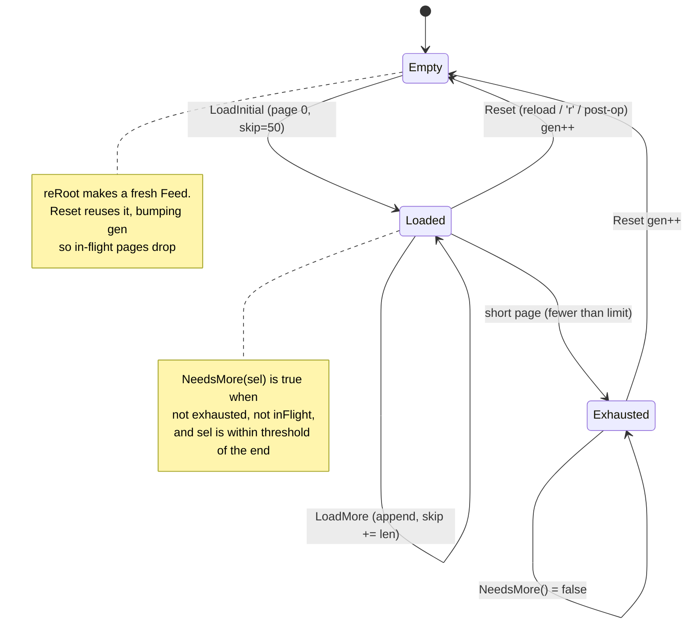

# commitfeed (CQRS stage 3) — diagrams

Companion to the stage-3 design. Renders on GitHub or any Mermaid viewer.

Decision: the `CommitFeed` is a **stateful domain read-model** in
`internal/domain` and is the **single source of truth for commits**.
`Snapshot` no longer reads commits. The TUI signals intent and subscribes;
it never accumulates.

---

## Class diagram — components & relationships

---

## Sequence — startup (parallel Snapshot + initial commit page)

---

## Sequence — paging (UI signals intent, Feed loads, UI re-subscribes)

---

## State — the Feed lifecycle

