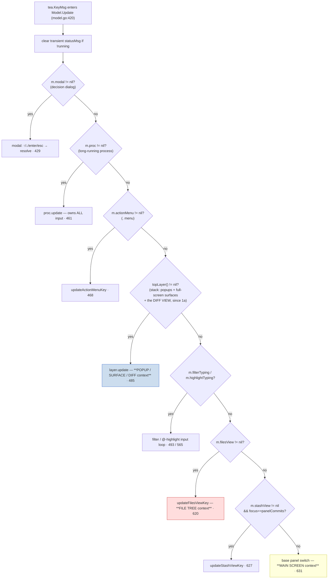
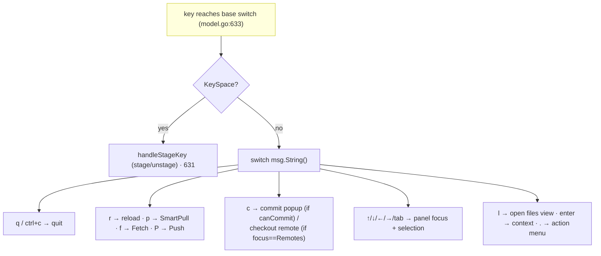
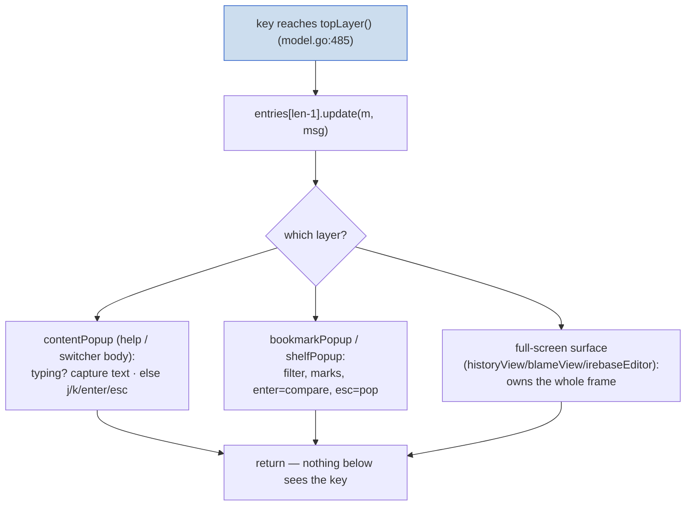
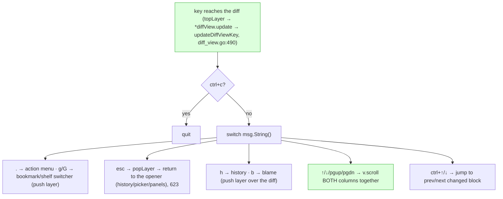
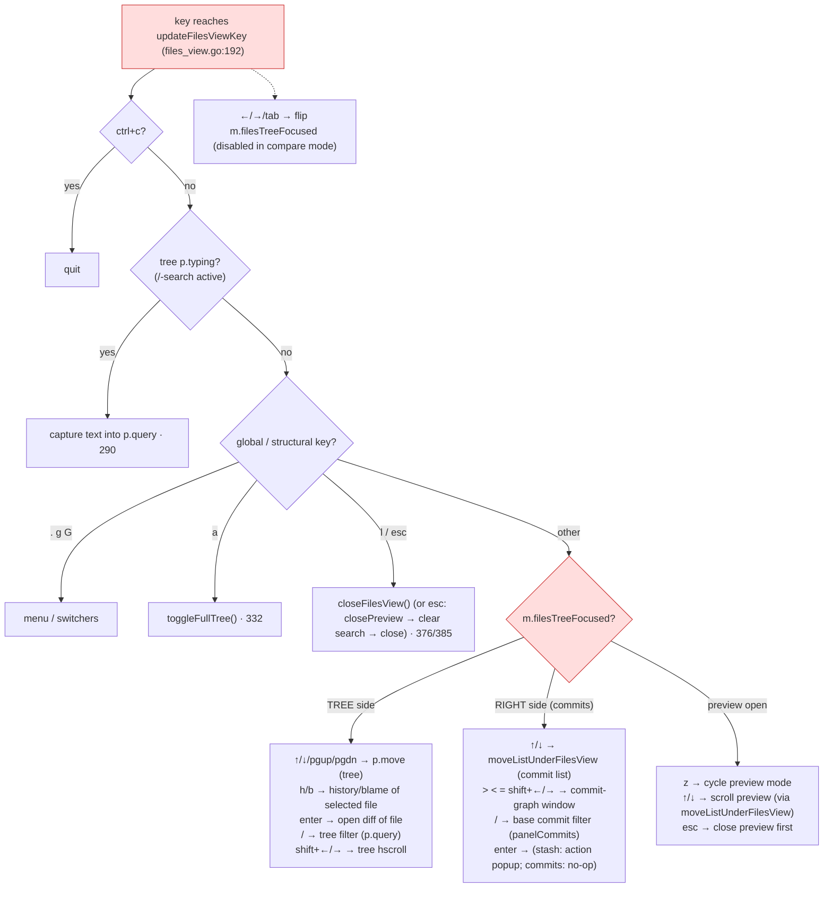
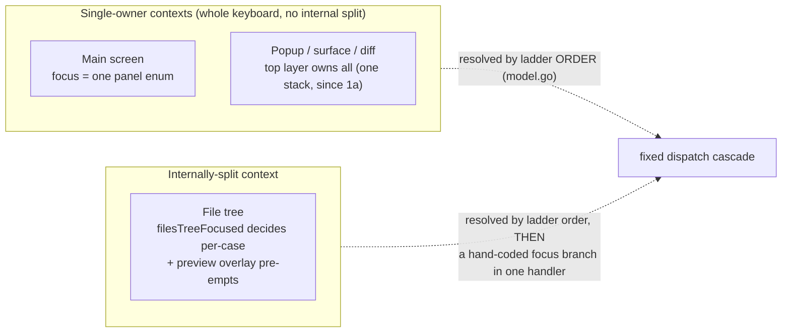

# How a keypress resolves to an action (by context)

**Status:** Reference / architecture note.
**Date:** 2026-06-22; **refreshed 2026-06-23** for windowing Stages 1a (diff →
stack layer) and 1b (files-view state machine).
**Scope:** The TUI key-dispatch path for the four contexts asked about — the main
screen, the file tree, the diff view, and a popup. All line citations are
`internal/tui/` on `main`.

> **What changed since the original (2026-06-22):** Stage 1a promoted the diff
> from a standalone `Model` field with its own dispatch rung onto the **single
> layer stack** — so the diff is now part of the `topLayer()` rung alongside
> popups/surfaces, not a separate rung below it. Stage 1b turned the file view's
> scattered state into a `filesMode` state machine (transition methods are the
> sole mutators), which removed the "reset-bug class" this doc originally cited —
> the *routing* split it describes is unchanged. Both are reflected below.

---

## The one rule that governs everything: a fixed dispatch ladder

Every `tea.KeyMsg` enters `Model.Update` (`model.go:420`) and falls through a
**single ordered cascade**. The **first rung that matches claims the key and
returns** — nothing below it sees the keypress. There is no central "focus
object" and no key→action table: routing *is* the order of these `if` guards.

The four contexts map onto the ladder like this (post-1a, the **popup and diff
share one rung** — the stack):

| Context | Rung / guard | Handler | Owns keyboard above… |
|---|---|---|---|
| **Popup / surface / diff** | `topLayer()` `model.go:485` | `layer.update` (the diff's is `*diffView.update`, `diff_view.go:582`) | the files view, main screen |
| **File tree** | `m.filesView` `model.go:620` | `updateFilesViewKey` | the main screen |
| **Main screen** | fall-through `model.go:631` | inline `switch` | nothing (it's the floor) |

> **The asymmetry the windowing investigation hinged on — now half-resolved.**
> Originally the diff was a hard-coded rung *below* the stack, so a diff and a
> popup had a frozen z-order and the diff couldn't carry a return target. Stage 1a
> moved the diff onto the **one** stack: popups, full-screen surfaces, and the diff
> now share a flexible, push/pop z-order (a diff opened over history `esc`-returns
> to history; a popup pushed over a diff covers it; etc.). What remains off-stack
> as fixed rungs is the **file tree** and the **stash list** — they still can't be
> z-ordered against the stack, only sit at their fixed position in the cascade.

---

## 1. Main screen (base panels)

The floor of the ladder. Reached only when **no** modal/proc/menu/popup/diff/
files/stash claimed the key first. A flat `switch msg.String()` over the
app-global verbs, most gated by which panel has focus (`m.focus`) and by
`m.running`/`m.loading`.

Key facts:
- **Focus is a single enum**, `m.focus panel` — one panel owns selection/motion at
  a time. There is no split here; each panel is whole.
- Many keys are **context-gated, not focus-routed**: e.g. `c` does *checkout* when
  `focus==panelRemotes` and *commit* otherwise (`model.go:654`); the same physical
  key resolves by panel, inline in the case body.
- Opening heavier surfaces happens here: `l` builds `m.filesView`, `c` pushes a
  `commitPopup` onto the layer stack, etc. — i.e. the main screen is what *creates*
  the higher rungs.

---

## 2. Popup (the layer stack)

`topLayer().update(m, msg)` (`model.go:485`). The **topmost layer owns the entire
keyboard**; everything beneath is frozen (its state preserved, not torn down). A
popup is just a `layer` (`layer_stack.go:11`) that composites a centered box over
the render of everything below it.

Key facts:
- **Single owner, no fall-through.** Unlike the base switch, an unhandled key in a
  popup is simply swallowed — the stack never forwards downward.
- A popup can open *another* popup, or open the diff — **since 1a, by pushing the
  diff as a layer** (`openPickerDiff` → `pushLayer`; the old `clearLayers`-then-set-
  field handoff is gone). `esc` pops one layer, revealing the parent intact — which
  is why a child cheat-sheet returns to the switcher beneath it, *and* why a
  picker-opened diff `esc`-returns to its picker.
- `isFullScreenLayer` (`layer_stack.go:22`, now including `*diffView`) distinguishes
  a surface (owns the screen) from a popup (composites over a backdrop) **for
  rendering only**; both route keys identically through `update`.

---

## 3. Diff view

**Since 1a, a stack layer** (`*diffView.update`/`render`, `diff_view.go:582`/`589`),
so it routes through `topLayer()` like any popup/surface — no dedicated rung. The
key logic still lives in `updateDiffViewKey` (`diff_view.go:490`), which the layer
`update` delegates to. A full-window surface with a **single logical focus**: the
two side-by-side columns scroll **in lockstep** — one `v.scroll(...)` moves the
whole view. There is *no* left/right pane focus.

Key facts:
- **Tiled render, single focus.** It looks split but isn't a focus-split — it
  exercises two-column *rendering* but never two-pane *routing*. (This is why it's
  a poor proving ground for a focus-split windowing primitive: there's nothing to
  route.)
- It pushes layers *over* itself (`h`/`b`/`g`/`G` → `pushLayer`); they sit higher on
  the **same stack**, and `esc` pops back down to the diff — then `esc` again pops
  the diff to *its* opener. Z-order is now read from the stack, not a fixed rung.

---

## 4. File tree (the files view) — the only context with an internal focus split

`updateFilesViewKey` (`files_view.go:285`). This is the complex one: a **single
dispatch handler that itself splits by a second focus flag**, `m.filesTreeFocused`.
Almost every case re-asks "which side is focused?" and routes accordingly. There
is also a *third* level — an optional `filesPreview` overlay that pre-empts some
keys. (Stage 1b cleaned up the view's *state* — modes/resets now go through
transition methods — but the *routing* split described here is unchanged.)

Key facts:
- **Focus is a second flag, checked per-case.** `m.filesTreeFocused` (`files_view.go`
  `left`/`right`/`tab` cases at `446-456`, now via `focusTree()`/`focusRight()`)
  decides, inside almost every motion/verb case, whether the key drives the **tree**
  (`p.move`) or the **right column** (`moveListUnderFilesView`). The split is
  hand-coded, case by case — not a structural property.
- **The right "pane" is not a self-contained window — it's the base Commits panel.**
  When focus is on the right, `/` sets `filterPanel = panelCommits` (`files_view.go:398`)
  and `>`/`<`/`=` drive the *same* commit-graph state the main screen uses
  (`m.commitGraphCols`, `commitGraphScroll`). The files view is *borrowing* the base
  panel's behavior, re-implemented through these guards.
- **Third level: the preview overlay.** When `m.filesPreview != nil` it pre-empts
  `z`, `esc`, and the scroll keys (`files_view.go:320,376`; motion funnels through
  `moveListUnderFilesView`). So a single keypress can resolve at three nested
  levels: *files-view handler → focused side → preview-open?*
- **This is exactly the hand-rolled split** the windowing investigation
  (`2026-06-22-split-layer-windowing-investigation.md`) is about: the routing logic
  that a `splitLayer`/pane abstraction would centralize lives here, spread across
  the `switch`. (Stage 1b funnelled the view's *state* through a `filesMode` state
  machine — that ended the reset-desync bug class — but the *routing* split is the
  remaining target, deferred with the rest of the focus-split framework.)

---

## Summary: four contexts, two routing styles

- **Main screen, and the stack (popups / surfaces / the diff)** are each a *single
  keyboard owner*: the ladder picks the handler, and that handler owns the key
  outright (the stack swallows unhandled keys; the main screen is the fall-through
  floor). Since 1a the diff lives on that one stack, so its z-order/return is read
  from the stack rather than a fixed rung.
- **The file tree** is the outlier: the ladder routes to one handler, but that
  handler then performs its **own** focus split (`filesTreeFocused`) and overlay
  check (`filesPreview`) — re-deriving, per case, what a structural windowing
  primitive would provide once. Stage 1b removed the *state*-desync (reset-bug)
  class via the `filesMode` state machine; the per-case *routing* re-derivation is
  what remains, and is the standing motivation for the deferred focus-split work.
