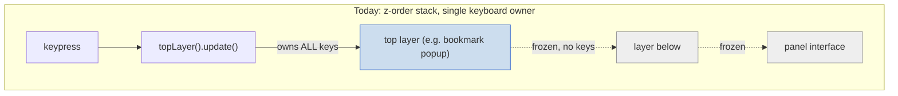
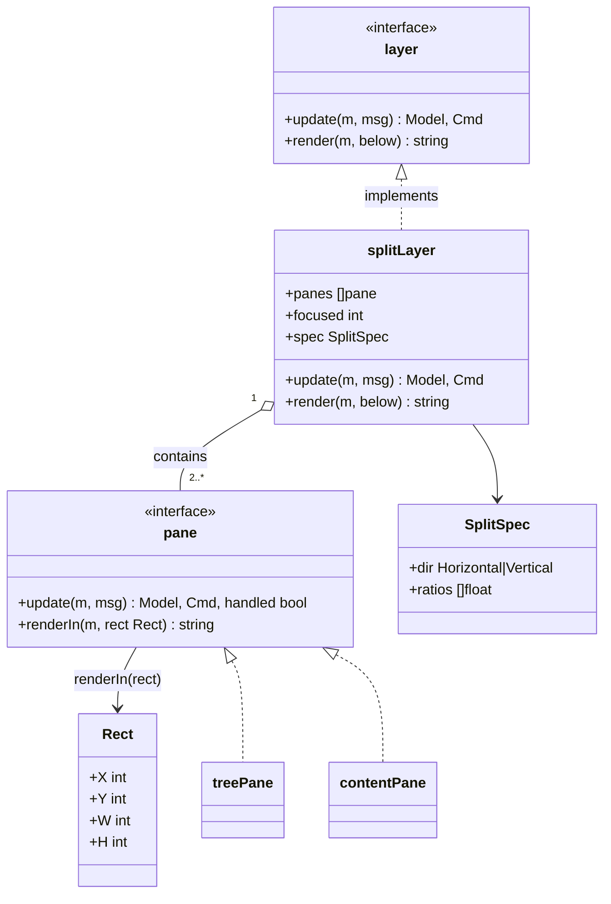
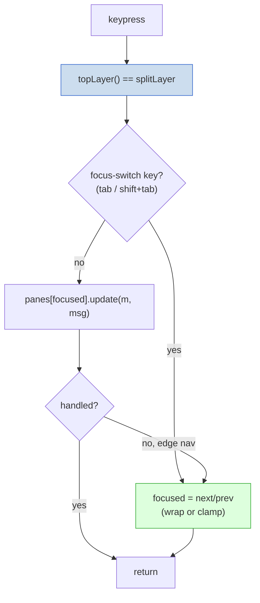
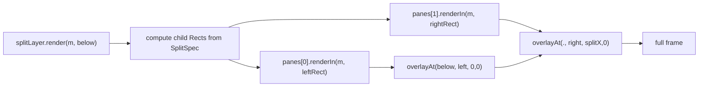
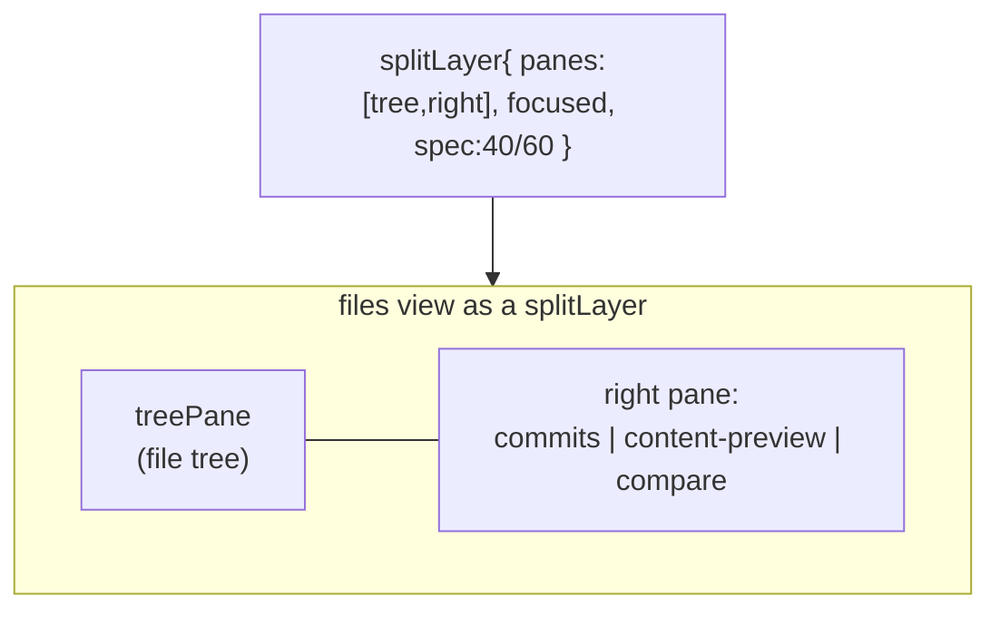
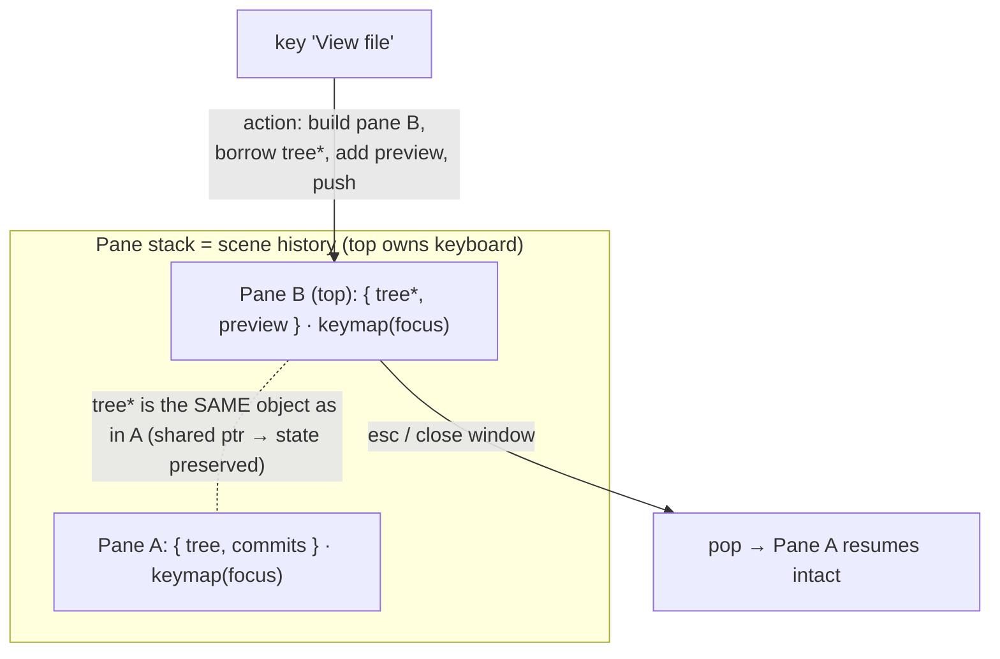

# Investigation: enhancing the layer stack to handle same-level split windows

**Status:** Architecture investigation / verdict. **Partly executed since
2026-06-23:** the de-risked phasing this doc recommended is underway — Stage 1a
(promote the diff to a stack layer, merged `c94a4f0`) and Stage 1b (the files-view
`filesMode` state machine, merged `4741640`) are DONE; the full scene-stack /
focus-split framework remains **deferred** as argued below (one focus-split
client). The verdict and rationale stand as written.
**Date:** 2026-06-22 (verdict); status updated 2026-06-23.

## Problem

The TUI layer stack (`internal/tui/layer_stack.go`) cannot represent two windows
that **share the viewport at the same level** with focus split between them (e.g.
the files-view file tree on the left and a content preview on the right, both
live, focus switching with `←/→/tab`). Surfaces that need this today (the files
view's tree‖right split) re-implement focus + tiling by hand, outside the stack.

## Root cause: two baked-in assumptions

1. **Dispatch is single-focus.** Key handling does
   `if l := m.topLayer(); l != nil { return l.update(m, msg) }` and returns
   immediately — the top layer owns the *entire* keyboard; everything beneath is
   frozen.
2. **Render is full-screen.** The contract is `render(m, below) string`, returning
   a whole-screen frame. There is no "render into *this* sub-rectangle." Surfaces
   own the screen; popups center a box over `below`.

Side-by-side *rendering* is almost expressible (a layer could draw in a column and
let `below` show through), but there is no rect contract, and keys still go only
to the top. So co-resident windows with split focus are not representable, and the
base panel/tiling layout (`panel`, `m.focus`, `filesTreeFocused`) is a separate,
bespoke mechanism that each split surface re-derives.



## Proposed enhancement: a `splitLayer` composite + a `pane` contract

Keep the stack a pure z-order. Add **one new kind of layer** — a `splitLayer` —
that *is* a `layer` (so it lives on the stack like any surface) but internally
holds N child **panes**, a focused index, and a split spec. It centralizes the two
things every split surface currently hand-rolls: **focus switching** and **tiled
rendering**.



Two deliberate contract additions live on `pane` (not on `layer` — existing
popups/surfaces stay untouched):

- **`renderIn(m, rect)`** — renders into a given rectangle instead of full-screen.
  This is the missing piece that makes tiling first-class. The split composes
  children with the existing `overlayAt(bg, block, x, y, …)` primitive (already
  used for tooltips).
- **`update` returns a `handled bool`** — so the split can offer a key to the
  focused pane first and, if unconsumed at an edge, treat it as a focus move.
  (Simpler starting point: the split *reserves* dedicated focus keys —
  `tab`/`shift+tab` — and never forwards them, exactly like the panel layout.)

## Key routing — solved structurally

The manual routing currently threaded through `updateFilesViewKey` becomes the
split's job, in one place. No change to the stack's dispatch — `topLayer().update`
already delegates to the split; the split does the internal focus routing.



## Render — tiling via sub-rects



The focused pane gets the focused border; the spec's `ratios` handle 40/60 etc.;
nesting a `splitLayer` inside a pane yields arbitrary tiling — without touching the
z-stack.

## First client: the files view / preview



- `filesTreeFocused` → the split's `focused` index. `←/→/tab` → the split's focus
  moves. The hand-routed `moveListUnderFilesView` / preview-scroll guards →
  "delegate to the focused pane."
- The **preview stops being a special case** — it is one possible occupant of the
  right pane (alongside the commit list and compare), swapped by content, not by
  routing logic.
- It is a good proving ground: a real surface that already hand-rolls exactly this.

## Trade-offs

| | Add `splitLayer` + `pane` | Make `layer.render` rect-aware globally | Status quo |
|---|---|---|---|
| Touches existing popups | No (panes opt-in) | Yes — every layer updated | No |
| Removes bespoke split routing | Yes | Partially | No |
| Reusable for future split windows | Yes, out of the box | Yes | No |
| Risk | Medium (one composite + first migration) | High (broad signature change) | None |

## Recommendation

The additive `splitLayer`/`pane` route. It leaves the z-stack and all existing
overlays pristine, introduces tiling as a composable layer, and its first client
(the files view) already hand-rolls exactly this — so the migration both proves
the abstraction and deletes the bespoke routing that motivated it.

The deeper, optional end-state: the base panel layout itself could eventually be
expressed as a top-level `splitLayer` tree, unifying "tiling" and "stacking" under
one model. That is a later, larger step — not a prerequisite.

## Refined model (recommended): a stack of *scenes* (panes) with focus-predicated keymaps

A cleaner framing that **subsumes** `splitLayer`: make **every stack entry a
pane**, where a pane is a *scene* — a set of windows (held by pointer) plus a
**key→action map predicated on focus** (which window is focused decides what each
key does). This is more unified than the additive `splitLayer` (one concept, not
two), and leans entirely on the existing push/pop stack.

Lifecycle:

- A key whose action needs a **different set of windows** does not mutate in
  place — it **builds a new pane** that gathers the existing windows (by pointer,
  so scroll/selection state survives) **plus** the new window, and **pushes it**.
  The window *set* changing is what creates a pane; content changing *within* the
  same set does not (e.g. toggling full-tree mutates the tree window; opening the
  preview pushes a pane).
- **Close = pop** the top pane, revealing the previous scene intact (never torn
  down — matches the stack's existing contract).
- The **keymap travels with the pane**, so available keys change as the
  composition changes. The same shared window (e.g. the tree) is driven by
  *different* keymaps depending on the active pane → its actions are automatically
  context-dependent. That is the core idea.

No change to stack dispatch: the top pane is still the single keyboard owner; it
splits *internally* by the focus predicate. (Same realization as `splitLayer`, but
here the pane *is* the split composite and every entry is one.)



### Open design points (where the effort goes)

1. **Layout is the unspecified half.** The keymap story is elegant, but a pane
   must also own *layout* — which window in which rectangle, at what size. Still
   needs a rect-aware window render (`renderIn(rect)`); the pane owns it.
2. **Ownership across shared panes.** Rule: a pane *owns* windows created with it
   and *borrows* (by pointer) windows from below; popping releases only the owned
   ones — never a borrowed window a lower pane still references.
3. **Keymap representation = the real new machinery.** A per-pane
   `keymap[focusedWindow][key] → action`, where actions may push/pop panes or
   mutate windows. As one disciplined registry it *replaces* the scattered
   switches (the win); done ad-hoc it becomes a new parallel mess. Put the design
   effort here.
4. **Re-entrancy.** Pushing the same scene over itself (preview over preview):
   define replace-vs-nest (likely replace).

## Independent review findings (Plan/architect agent, 2026-06-22)

A read-only architecture review verified the doc against the code. The
**descriptive analysis was confirmed accurate** (single-focus dispatch
`model.go:478`; full-screen render contract `layer_stack.go:11`; files view a
separately-dispatched Model field `model.go:619`). But the **recommendation is
under-scoped** — verdict: *send back, do a de-risking refactor + a spike before
locking primitives.* The substantive catches:

- **The files view is the WORST proving ground, not the best.** Its "right pane"
  is the base **Commits panel** (`panelCommits`), whose keymap (filter, `@`
  highlight, graph `>`/`<`/`=`, paging, follow-live reload) lives in the *base*
  dispatch, not in a self-contained window object. "The preview is just another
  right-pane occupant" breaks precisely where one occupant is the root surface.
- **"Shared by pointer → state survives" is largely false here.** Files-view
  state is ~10 scattered `Model` scalars (`filesHash`, `filesCompare`,
  `filesAllFiles`, `filesPreviewTag`, … `model.go:58-70`), not inside the
  `*contentPopup`. So the real first step is a **state-extraction refactor**,
  which this doc never names and which is the bulk of the work.
- **A context-predicated action registry already exists** —
  `availableActions(m)` (`action_menu.go:28`) + `actionRow{run: …}`, already used
  by `viewFileRow` (`file_preview.go`). The proposed "keymap machinery" would be a
  *parallel* registry that must be **reconciled, not invented**.
- **Missing risks not in the 4 open points:** (1) **render-backdrop regression** —
  `renderLayers` only folds a layer into the backdrop when `isFullScreenLayer`
  (4 types, `layer_stack.go:22-28`); a pane is neither, so the files view would
  visually vanish under a popup. (2) **`modal`/`proc`/`actionMenu` dispatch ABOVE
  the stack** (`model.go:429,461,468`) while the files view dispatches *below* it
  (`model.go:619`) — moving it onto the stack reorders all of these (incl. the
  action menu that must open *over* the files view, and `diffView` opened by
  `enter` as a sibling field). (3) **Mouse routing omitted** — `mouseInFilesView`
  (`mouse.go`) hand-hit-tests tree-vs-commits by geometry; panes-own-rects forces
  this into the pane too. (4) **Focus keys already overloaded** — `←/→` move focus
  while `shift+←/→` scroll/pan and `tab` is the base panel-cycle key; the
  "reserve tab for focus" starting point collides.
- **The `contentPopup` double life:** the same type is BOTH a stack layer (help)
  AND a Model field (`filesView`/`filesPreview`); `content_popup.update` branches
  on `m.filesView == p`. Any pane model must grapple with this duality.

## Suggested phasing (revised per review — de-risk before locking primitives)

1. **State-extraction refactor (pays off regardless of any windowing decision).**
   Pull the ~10 scattered files-view `Model` scalars into a single
   `filesViewState` struct held behind a pointer. Independently testable; no new
   abstraction yet. This is the precondition any pane could carry state across a
   push/pop.
2. **Spike the primitive on a genuinely SELF-CONTAINED two-window surface — not
   the files view** (whose right side is the root panel). Prototype `Rect` +
   `renderIn(rect)` + a pane that tiles two self-owned windows with focus routing,
   and confirm it composites correctly with the existing backdrop/`isFullScreenLayer`
   logic, the above-stack `modal`/`proc`/`actionMenu` layers, and mouse hit-testing.
   Only after the spike, freeze the primitive shapes.
3. **Reconcile with `availableActions`** — the pane keymap must extend the
   existing action registry, not parallel it.
4. **(Only then) evaluate the files view / base panel layout** as panes — now with
   the frictions known rather than discovered mid-migration.

> Note: the doc earlier labeled BOTH the `splitLayer` table row and the scene-stack
> section "recommended" — resolved here: the scene-stack is the conceptual
> direction; the *actionable* recommendation is the de-risked phasing above
> (extract state → spike on a self-contained surface → reconcile with
> `availableActions`), not an immediate files-view migration.

## Verdict: does this make sense for the architecture, maintainability, and future? (2026-06-22)

Judged against the three axes the design has to earn its place on. Short answer:
**the conceptual model is sound, but only Phase 1 (state extraction) is justified
to build now; the tiling/scene abstraction is currently speculative generality
(one real client) and should wait for a forcing function.**

### Axis 1 — fit with the current architecture: partial, with a real impedance mismatch

The scene-stack's premise is "everything lives on the stack; the top entry owns
the keyboard." The TUI does **not** work that way. Key dispatch is a **fixed
7-rung ladder**, of which the stack is just rung #4:

```
modal (model.go:429) → proc (461) → actionMenu (468) → topLayer()/stack (478)
   → diffView (484) → filter input (487) → filesView (619) / stash / base panels
```

Three surfaces dispatch **above** the stack (`modal`/`proc`/`actionMenu`) and the
motivating client — the files view — dispatches **below** it (and so does
`diffView`, opened as a sibling field by `enter`). So "make the files view a pane
on the stack" is not a drop-in: it reorders an accreted cascade, and the action
menu specifically must keep opening *over* the files view. This is **migration
cost, not a prohibition** — one could argue the ladder is exactly the accretion a
unified model would clean up — but there is no cheap path and no forcing function
demanding it.

### Axis 2 — maintainability: the win is narrow and already half-built

- The genuine, present-day pain is **not** "no tiling abstraction." It is the
  **reset choreography**: files-view state is ~10 scattered `Model` scalars
  (`filesHash`, `filesAllFiles`, `filesPreview`, `filesCompare`, … `model.go:58-70`)
  that must be hand-reset at every entry/exit/mode-switch site (l-open, esc, `a`,
  `openCompareFiles`). Both recent features (full-tree, preview) hit bugs in that
  choreography. A `filesViewState` struct with one reset point removes that whole
  bug class — **with zero new abstraction.** That is the maintainability payoff,
  and it stands alone.
- The scene model's headline idea — **"a keymap predicated on focus"** — is
  **already implemented**, for the `.` menu: `availableActions` (`action_menu.go:58`)
  literally branches on `!m.filesTreeFocused && m.filesHash != ""` to pick the
  focused side's actions. So the new machinery would not be invented from scratch;
  the honest work is **extending that existing registry to raw-key dispatch**, and
  if instead a *parallel* keymap registry is built, that is a maintainability
  **loss** (two registries to keep in sync).

### Axis 3 — future development: thin demand for the focus-split half (the YAGNI cut)

The abstraction only pays off at the **second** split surface. There isn't one:

- The **only other tiled surface today is `diffView`**, and it scrolls both
  columns **in lockstep** (`v.scroll` moves the whole view — `diff_view.go:518`):
  a tiled *render* with a **single logical focus**. It would exercise
  `renderIn(rect)` but **not** the focus-routing machinery that is the heart of the
  proposal.
- Every roadmap surface that's coming (interactive rebase `irebaseEditor`, staging
  `hunkPicker`, conflict editor `conflictProcess`, blame, history, visual graph) is
  **full-screen, single-focus** — already cleanly handled by the existing stack /
  process model.

So the **focus-split scene/pane abstraction has exactly one client (the files
view) and no second one on the horizon.** Building a reusable tiling+keymap
framework for a single client is speculative generality.

### Recommendation

1. **Build now: Phase 1, the `filesViewState` extraction.** Justified entirely on
   its own (kills the reset-choreography bug class); independent of any windowing
   decision; small and independently testable.
2. **Defer the tiling primitive and the scene-stack reframe** until a genuine
   second focus-split surface appears (the forcing function). Revisit *then*, with
   the dispatch-ladder and `availableActions`-reconciliation frictions already
   mapped above.
3. **If we still want to prove the primitive sooner**, the better spike target than
   the files view is a *new* self-contained two-window surface — **not** `diffView`
   (lockstep, no focus split) and **not** the files view (right pane is the root
   Commits panel). Absent such a surface, the spike is premature.

**Net:** the model is coherent and the analysis was worth doing — it correctly
locates where the complexity actually lives — but the architecture is telling us to
take the one cheap, always-good win (state extraction) and let the bigger
abstraction wait for a real second client rather than be built on spec.
