# TUI window architecture — abstraction levels & open-flows

**Status:** Architecture reference (living doc).
**Date:** 2026-06-23. Reflects windowing Stages 1a (diff → stack layer) and 1b
(files-view state machine).
**Scope:** how the `internal/tui` window system is layered, how the high-level and
middle-level abstractions interact, and the open-flow for each kind of window
(ranked by how often it is opened). All citations are `internal/tui/` on `main`.
**Companions:** `2026-06-22-key-routing-by-context.md` (the dispatch ladder per
context), `2026-06-22-windowing-zorder-root-cause.md`, the `adding-tui-windows`
skill (the build-time decision guide).

---

## 0. The two abstraction levels at a glance

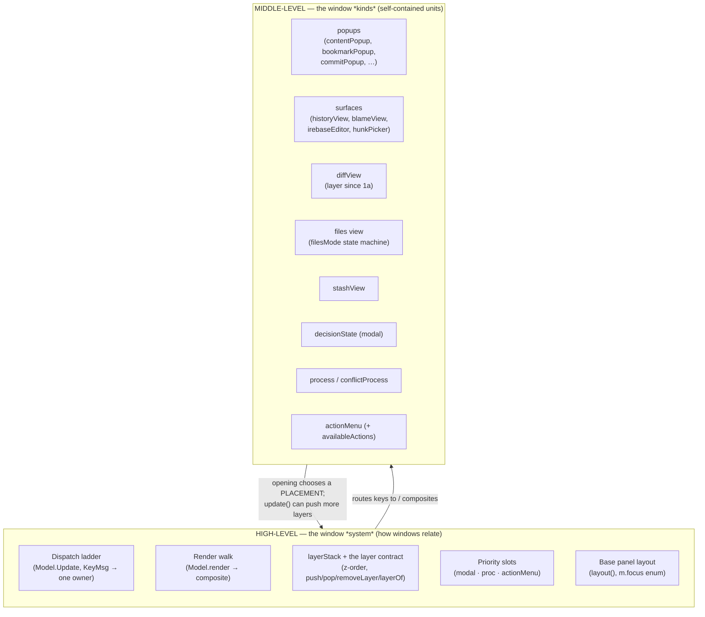

- **High-level = the *system*.** It owns the answers to "who is in front, who owns
  the keyboard, what is revealed when one closes." It does **not** know what any
  particular window *does*.
- **Middle-level = the *kinds*.** Each is a self-contained unit: its own state, its
  own `update` (key handling) and `render`. It does **not** know the dispatch order
  or what sits beneath it.
- **They meet at three placements** (next section): a window is opened *onto* the
  stack, *into* a `Model` field, or *into* a priority slot. That placement choice
  is the entire contract between the two levels.

---

## 1. High-level: the three placements

Every window lives in exactly one of three places. This is the central high-level
abstraction — it decides routing, render order, and close semantics.

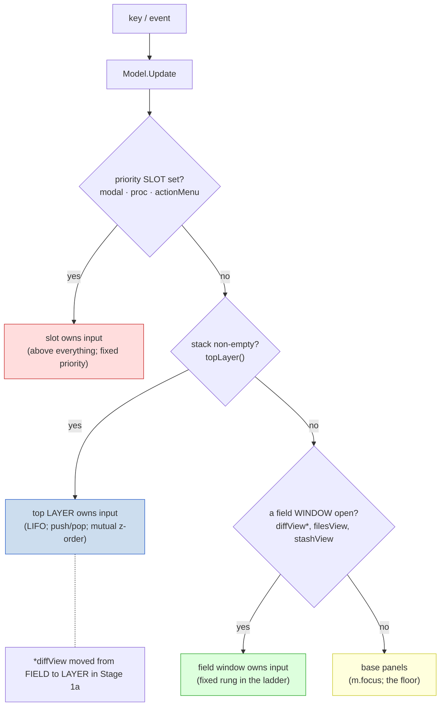

| Placement | Mechanism | Z-order semantics | Close | Who lives here |
|---|---|---|---|---|
| **Priority slot** | `m.modal` / `m.proc` / `m.actionMenu` | **Above** the stack, fixed priority `modal > proc > actionMenu` | set the field `nil` | decision dialogs, the conflict process, the `.` menu |
| **Layer stack** | `pushLayer` / `popLayer` / `removeLayer` | **LIFO, mutual** — anything can sit over anything; order is chosen at runtime | `popLayer` reveals the parent intact | popups, full-screen surfaces, **the diff** |
| **Model field** | `m.filesView` / `m.stashView` | **Fixed rung** in the dispatch ladder; cannot be z-ordered against the stack | set the field `nil` (`closeFilesView`) | the files view, the stash list |

**Why three and not one?** The slots have genuine "always-on-top regardless of
push order" semantics (a modal must beat even a process that raised it) that a LIFO
stack cannot express — so they are *correctly* outside the stack. The field windows
(files view, stash) are entangled with the base panel layout (they share the
left/right columns and the `m.focus` enum), so they are not yet stack citizens.
**Unifying the field windows onto the stack is the deferred Stage 3** — see the
investigation doc.

### The layer contract (the stack's whole vocabulary)

```mermaid
classDiagram
    class layer {
      <<interface>>
      +update(m, msg) ModelAndCmd
      +render(m, below) string
    }
    class layerStack {
      +entries listOfLayer
    }
    class Model {
      +layers layerStack_ptr
      +modal decisionState_ptr
      +proc process
      +actionMenu actionMenu_ptr
      +filesView contentPopup_ptr
      +stashView stashView_ptr
      +filesMode filesMode
    }
    layerStack "1" o-- "*" layer
    Model --> layerStack
    layer <|.. contentPopup
    layer <|.. diffView
    layer <|.. historyView
    layer <|.. blameView
    layer <|.. irebaseEditor
    layer <|.. hunkPicker
    layer <|.. bookmarkPopup
    layer <|.. commitPopup
```

The stack API (`layer_stack.go`): `pushLayer` (40), `popLayer` (50), `removeLayer`
(96, by-identity — for a window that may not be top, e.g. the diff on resize),
`layerOf[T]` (72, find the live window of a type), `topLayer` (31), `isFullScreenLayer`
(22, render-only: surface vs centered popup).

### Render is the mirror of dispatch

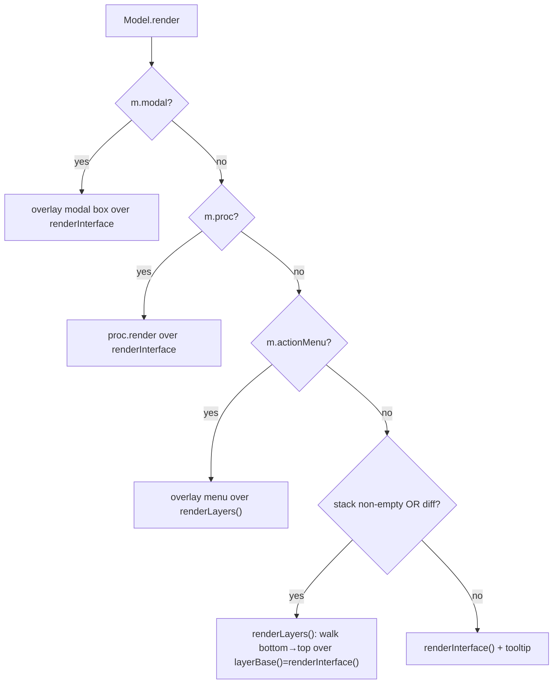

Render order mirrors dispatch priority: `modal → proc → actionMenu → layers/diff →
base`. `renderLayers` (`view.go:133`) walks the stack bottom-to-top; full-screen
surfaces own the frame, centered popups composite over the surface beneath. Since
1a the diff is just another layer in that walk, so `layerBase()` is simply
`renderInterface()` (the old diff special-case is gone).

---

## 2. Middle-level: the window kinds

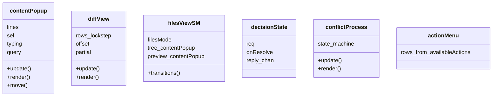

> `contentPopup` is reused **four ways**: a stack popup (help/cheat-sheet), the
> files-view tree (field), the file preview (field), and switcher bodies.
> `filesViewSM` is the `filesMode` machine + its fields (not a single struct — the
> "transitions are the only mutators" property is the abstraction). `diffView`
> scrolls both columns in **lockstep** (single logical focus).

The middle-level taxonomy by placement:

| Kind | Placement | Notes |
|---|---|---|
| **`contentPopup`** | layer *and* field (both) | the workhorse list/pager: help popup (layer), files tree + preview (fields), switcher bodies |
| **`diffView`** | layer (since 1a) | side-by-side, single logical focus (lockstep scroll) |
| **surfaces** (`historyView`/`blameView`/`irebaseEditor`/`hunkPicker`) | layer | full-screen (`isFullScreenLayer`) |
| **popups** (`bookmarkPopup`/`commitPopup`/`worktreePopup`/…) | layer | centered boxes |
| **files view** (`filesMode` + transitions) | field | the most complex: internal focus split + preview overlay; state is a machine (1b) |
| **`stashView`** | field | right-column list, coexists with the base panels |
| **`decisionState`** | slot (`m.modal`) | option-list decision from an engine op |
| **`process`/`conflictProcess`** | slot (`m.proc`) | exclusive interface lock; a state machine |
| **`actionMenu`** | slot (`m.actionMenu`) | rows built by the `availableActions` registry |

> **The `contentPopup` double life** is the one cross-cutting subtlety: the same
> type is both a stack layer (help) and a `Model` field (`filesView`/`filesPreview`).
> Its `update` branches on `m.filesView == p` to know which role it is playing.

---

## 3. How high and middle affect each other

Two directions, one contract (the placement):

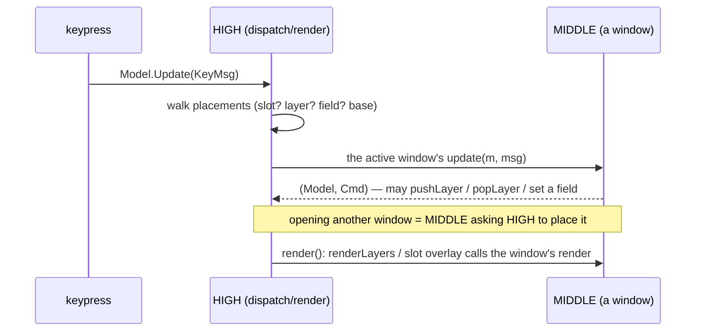

- **High → middle:** the ladder picks exactly one owner and hands it the key; the
  render walk calls that window's `render`. The system never inspects window
  internals.
- **Middle → high:** a window *opens* another by choosing a placement (`pushLayer`
  for a layer, set a field, set a slot). E.g. the diff pushes a `historyView` over
  itself; a switcher pushes a compare diff; the files view sets `m.diffView`… no,
  *pushes* a diff (since 1a). Closing calls `popLayer`/`removeLayer`/`closeFilesView`.

This is why the **return target is automatic for layers** (pop reveals the parent)
but **manual for fields** (you must nil the field, and `closeFilesView` is the
single chokepoint that does it completely — Stage 1b).

---

## 4. Open-flows, ranked by frequency

The flows you hit most. Each shows: trigger → open function → placement → async
load → message populates → render. **Tier 1 are the hot paths.**

### Frequency ranking

| Tier | Window | Trigger | Placement | Open fn |
|---|---|---|---|---|
| **1 (hottest)** | **Action menu** | `.` (any context) | slot | `openActionMenu` (`action_menu.go:440`) |
| **1** | **Files view** | `l` on a commit | field | `openChangedFiles` (`files_view.go:54`) |
| **1** | **Diff** | `enter` on a file | layer | build `diffView` + `pushLayer` |
| **2** | **Switchers** | `g` / `G` | layer | `openBookmarkSwitcher` / `openShelfSwitcher` |
| **2** | **File preview** | `.`→View file (full-tree) | field | `openPreview` (`file_preview.go`) |
| **2** | **Compare** | `.`→Compare / mark | field→layer | `openCompareFiles` → diff |
| **3** | **Surfaces** | `h` / `b` | layer | `newHistoryView` / `newBlameView` + push |
| **3** | **Modal** | engine op decision | slot | `m.modal = &decisionState{}` |
| **3 (rare)** | **Process** | merge/rebase conflict | slot | `m.proc = &conflictProcess{}` |

---

### Tier 1 — Action menu (`.`)  · most-opened of all

A priority slot built by a **context-predicated registry**: the same `.` resolves
to different rows depending on the focused window/side.

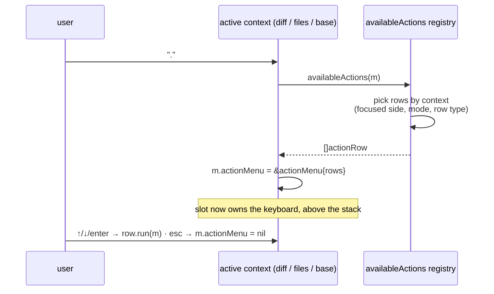

Key point: `availableActions` (`action_menu.go`) is already the
"keymap-predicated-on-focus" registry — it branches on `inContentWindow`,
`filesTreeFocused`, `filesHash`, the top layer, etc. Extending it to raw keys (not
just the menu) is the conceptual heart of the deferred routing unification.

### Tier 1 — Files view (`l`)  · the most-opened *content* window

A **field** window whose state is the `filesMode` machine (Stage 1b). Opening is a
single transition; content arrives async.

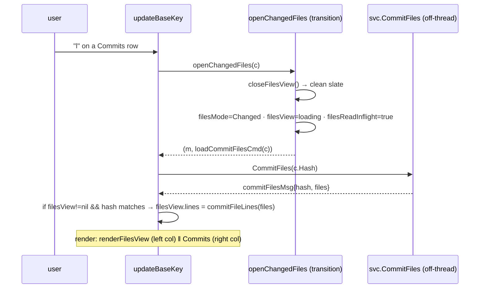

Closing is the single chokepoint `closeFilesView()` (zeroes the whole cluster);
`a` → `toggleFullTree`, `←/→/tab` → `focusTree`/`focusRight`, `.`→View file →
`openPreview` (a field overlay on the right column). See §"File tree" of the
key-routing doc for the internal focus split.

### Tier 1 — Diff (`enter` on a file)  · a LAYER since 1a

```mermaid
sequenceDiagram
    participant U as user
    participant FV as updateFilesViewKey
    participant ST as layer stack
    participant D as Differ (off-thread)
    U->>FV: "enter" on a tree row
    FV->>FV: build &diffView{loading}
    FV->>ST: pushLayer(diffView)
    FV-->>FV: (m, loadCommitDiffCmd(hash, line))
    FV->>D: diff hash:path
    D-->>FV: diffMsg{tag, view}
    FV->>FV: dv = layerOf[*diffView]; *dv = *view; loading=false  (in place — may not be top)
    Note over ST: render: renderLayers → diff full-screen over the files view beneath
    U->>ST: esc → popLayer → back to the files view (state intact)
```

The same `diffMsg` / `openPickerDiff` / `pushLayer` path serves every diff opener
(status panel, files view, history, bookmark/shelf compare) — `openPickerDiff`
(`bookmark_popup.go:434`) is the single seam for picker-launched diffs.

---

### Tier 2 — Switcher (`g` bookmark / `G` shelf)  · a centered popup LAYER

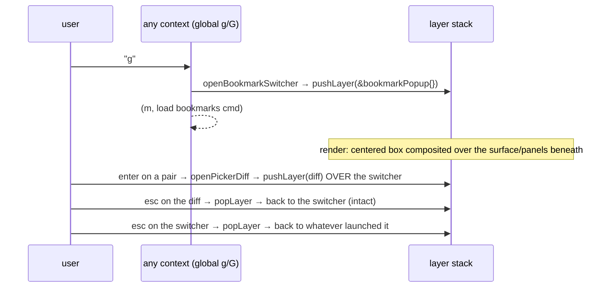

This nested push/pop (switcher → diff → back) is exactly what the unified stack
buys: each `esc` reveals the prior scene, no special-casing.

### Tier 2 — File preview / Compare

- **Preview** (`.`→View file in full-tree): `openPreview` sets `m.filesPreview`
  (a second `contentPopup` field) + focuses right; it is an *overlay within the
  files-view field*, not a stack layer. `esc` → `closePreview` (back to the tree).
- **Compare** (`.`→Compare / mark two): `openCompareFiles` (a files-view transition
  → `filesMode=Compare`); `enter` on a file then pushes a compare **diff layer**.

---

### Tier 3 — Surfaces (`h` history / `b` blame)  · full-screen LAYERS

```mermaid
sequenceDiagram
    participant U as user
    participant CTX as files view / diff
    participant ST as layer stack
    U->>CTX: "h" on a file (or from the diff)
    CTX->>ST: pushLayer(newHistoryView(ctx))
    CTX-->>CTX: (m, loadHistoryListCmd)
    Note over ST: isFullScreenLayer → owns the whole frame (ignores backdrop)
    U->>ST: enter on a commit → push a diff layer over history
    U->>ST: esc → popLayer → back to history; esc → back to the opener
```

### Tier 3 — Modal (engine-op decision)  · top-priority SLOT

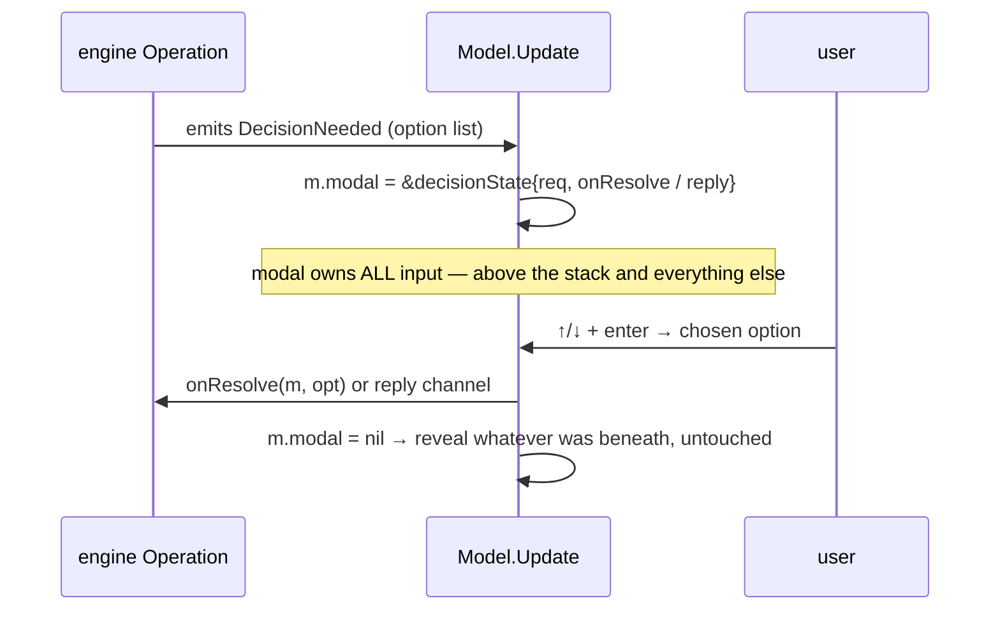

The modal sits at the very top because an operation may raise a decision *while a
process is running* — the decision must beat the process. Decisions are
**option-lists only** (no free text mid-flight), the same contract the CLI/MCP
deciders satisfy.

### Tier 3 — Process (conflict resolution)  · exclusive-lock SLOT

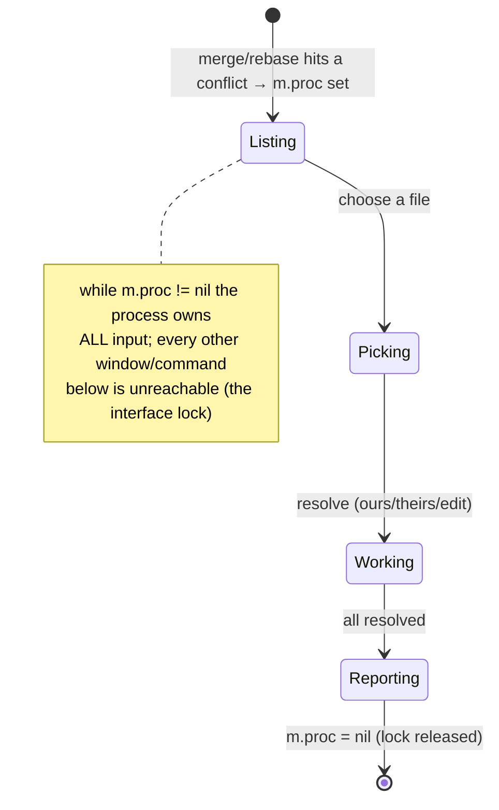

---

## 5. Choosing a placement for a NEW window (the decision guide)

When you add a window, the placement is the only architectural decision. (The
`adding-tui-windows` skill is the build-time companion to this.)

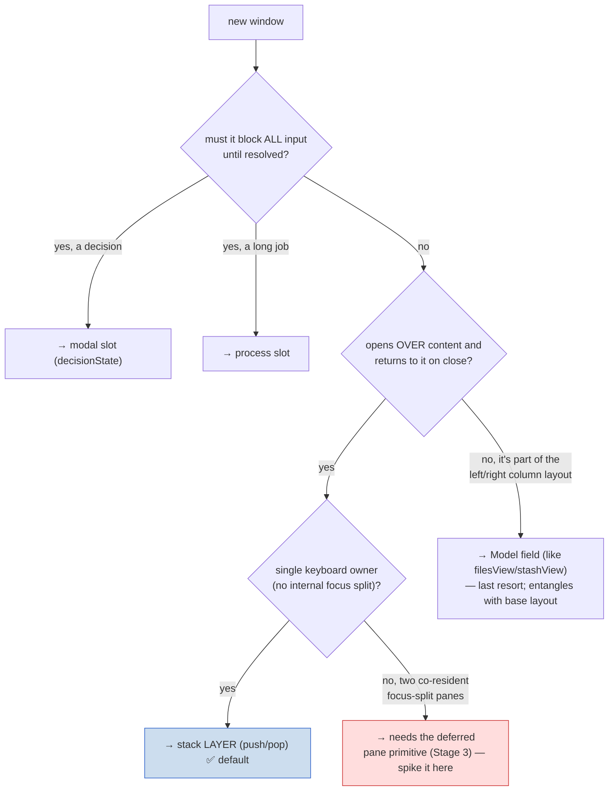

**Default to a stack layer.** Slots are only for true interrupts (decision / lock).
Fields are a legacy shape (files view, stash) that the unification work is
gradually retiring — prefer not to add new ones. A genuinely *focus-split* surface
(two independently-focused panes) is the trigger for the deferred pane primitive;
build that primitive on the new self-contained surface, not by retrofitting the
files view.

---

## 6. Summary

- **High-level** owns *relationships* (z-order, input ownership, return target) via
  **three placements**: priority slot, stack layer, `Model` field. **Middle-level**
  owns *behavior* (each window's state + `update` + `render`). The placement is the
  whole contract between them.
- **The stack is the unifying direction.** 1a moved the diff onto it; the slots stay
  out by design; the field windows (files view, stash) + the base panel layout are
  the remaining un-unified region (deferred Stage 3, gated on a second focus-split
  surface).
- **Hot open-paths:** `.` action menu (registry slot), `l` files view (field
  transition + async), `enter` diff (push layer + async-in-place). These three are
  worth knowing cold; everything else is a variation on push-a-layer-then-load.
